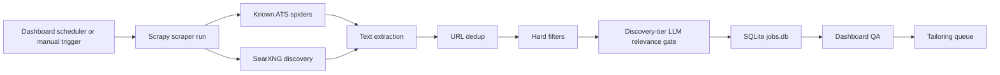

# Consultant Brief: Job Gathering System Review

Prepared for outside review of TexTailor's job-gathering pipeline.

## What We Want From You

We are looking for outside ideas on how to improve the quality, freshness, and
reliability of an automated job-discovery workflow. The current system works,
but the yield is uneven: runs complete successfully and find many raw results,
yet many items are duplicates, irrelevant, non-remote, non-US, too senior, or
otherwise filtered out.

Please focus on:

- Better job source strategy.
- Better freshness/yield metrics.
- Better deduplication and re-crawl policy.
- Better filtering and ranking.
- Better use of LLMs without wasting calls.
- Whether there are simpler architectural choices we are missing.

## One-Paragraph System Summary

TexTailor is a local job-search and application-tailoring workspace. A Scrapy
package gathers job postings from known ATS boards and from SearXNG web search,
runs deterministic filters and a discovery-only LLM relevance gate, then stores
all outcomes in SQLite. A FastAPI/React dashboard reads the database directly,
shows scraping health and QA queues, and passes selected jobs into a tailoring
engine that generates application packages.

## Current Architecture



Primary components:

- SearXNG local metasearch on `localhost:8888`.
- Scrapy job scraper in `job-scraper/`.
- SQLite database at `~/.local/share/job_scraper/jobs.db`.
- FastAPI/React dashboard on `localhost:8899`.
- Ollama-compatible local LLM endpoint on `localhost:11434`.

The dashboard does not ingest jobs via POST. It reads the SQLite database that
the scraper writes.

## Source Strategy

The scraper has two source tiers.

| Tier | Purpose | Current sources |
|---|---|---|
| `workhorse` | High-signal known companies and ATS APIs | Ashby, Greenhouse, Lever, Workable |
| `discovery` | Breadth and unknown-company discovery | SearXNG search results, legacy generic/aggregator paths |

Workhorse spiders use structured ATS APIs when possible:

- Ashby posting API.
- Greenhouse boards API.
- Lever postings API.
- Workable configured boards.

Discovery uses configured SearXNG query templates such as security, platform,
cloud, DevOps, AI, MLOps, and infrastructure roles, optionally constrained to
job-board sites. The discovery spider keeps only trusted job-board URL patterns
and drops obvious low-signal domains before the item pipeline.

For generic or mirrored pages, the fingerprint layer scans fetched HTML and
extracted text for original Ashby, Greenhouse, Lever, or Workable apply links.
When found, that embedded ATS URL and job ID become the preferred dedup identity.

## Scheduling And Rotation

The dashboard runs a tier-aware scheduler when enabled. Current defaults:

```yaml
scrape_profile:
  cadence: "0 */6 * * *"
  rotation_groups: 4
  seen_ttl_days: 45
  discovery_every_nth_run: 2
  target_net_new_per_run: 13
```

Each scheduled run:

1. Picks one stable rotation group.
2. Runs the `workhorse` tier every tick.
3. Runs `discovery` every other tick.
4. Skips if another scrape is active.
5. Records run metrics, rotation members, and gate mode.

Rotation is stable-hash based, so a given board consistently lands in the same
group. The goal is to avoid hammering every source every run while still
covering the full list over time.

## Filtering Pipeline

Current pipeline order:

```text
text_extraction -> dedup -> hard_filter -> llm_relevance -> storage
```

Pipeline behavior:

- Text extraction keeps existing JD text, extracts from HTML with Trafilatura,
  or falls back to a search snippet.
- Dedup checks `seen_urls` and drops URLs seen within the TTL.
- Hard filters mark bad matches as `rejected` with a stage and reason.
- The LLM relevance gate runs only for discovery-tier items.
- Storage writes both accepted and rejected outcomes to SQLite for auditability.

Major hard-filter categories:

- Domain/path blocklists.
- Bad company extraction.
- Seniority/title blocklist.
- Non-US geography.
- Non-remote or unclear remote status.
- Clearance/content blocklist.
- Salary below floor.
- Too many required years of experience.

The LLM relevance gate receives a small candidate profile plus job title,
company, board, URL, location, and snippet. It returns JSON with score, verdict,
reason, and flags. Low-scoring or rejected discovery items are stored as
`rejected`.

## Current Data Snapshot

Snapshot date: 2026-04-29 UTC.

Database totals:

| Metric | Count |
|---|---:|
| Total jobs | 3,603 |
| Leads | 213 |
| Pending | 24 |
| QA approved | 95 |
| QA rejected | 1,665 |
| Scraper rejected | 1,492 |
| Permanently rejected | 114 |

Largest board/source counts:

| Board | Count |
|---|---:|
| Ashby | 2,167 |
| LinkedIn | 515 |
| Unknown | 250 |
| Lever | 228 |
| HN Hiring | 194 |
| Greenhouse | 95 |
| Workday | 62 |
| SmartRecruiters | 38 |
| RemoteOK | 20 |

Top scraper rejection stages:

| Stage | Count |
|---|---:|
| `title_blocklist` | 752 |
| `geo_non_us` | 262 |
| `llm_relevance` | 225 |
| `not_remote` | 105 |
| `content_blocklist` | 73 |
| `company_sanity` | 27 |
| `domain_blocklist` | 18 |
| `experience_years` | 13 |
| `salary_floor` | 12 |
| `title_geo` | 5 |

Recent run sample:

| Run | Started UTC | Raw | Stored | Rejected | Errors | Gate | Group | Net new |
|---|---|---:|---:|---:|---:|---|---:|---:|
| `f0792aec6385` | 2026-04-29 01:00 | 598 | 103 | 101 | 7 | normal | 2 | 2 |
| `b877e8034fda` | 2026-04-28 19:00 | 2,058 | 12 | 8 | 0 | skipped_by_cadence | 1 | 4 |
| `b83442ddef60` | 2026-04-28 13:00 | 633 | 86 | 79 | 361 | normal | 0 | 7 |
| `87de11a63f2e` | 2026-04-28 01:00 | 2,287 | 7 | 4 | 0 | skipped_by_cadence | 3 | 3 |
| `0be23e48b290` | 2026-04-26 07:00 | 461 | 2 | 2 | 0 | no_discovery_items | 2 | 0 |
| `dc3efbf65214` | 2026-04-26 02:01 | 2,725 | 47 | 46 | 2 | normal | | 1 |
| `eebfdff006c9` | 2026-04-26 01:00 | 2,066 | 1 | 1 | 0 | skipped_by_cadence | 1 | 0 |
| `fc724f818274` | 2026-04-25 19:00 | 1,125 | 10 | 2 | 72 | normal | 0 | 8 |

Interpretation: the scheduler and subprocess mechanics are mostly healthy, but
the net-new useful yield is inconsistent. Some runs return thousands of raw
items but only single-digit useful additions. Discovery can find volume, but
much of it is rejected downstream.

## Known Pain Points

- Discovery via search can produce many irrelevant or low-detail hits.
- Workday and LinkedIn results can be noisy and hard to enrich reliably.
- Some direct ATS sources are saturated, producing repeated or stale jobs.
- Search snippets are often too thin for reliable filtering.
- Hard filters protect quality but may over-reject useful edge cases.
- The LLM gate helps but can spend calls on items that deterministic rules
  could have rejected earlier.
- Metrics distinguish raw/stored/rejected, but the system still needs clearer
  "actionable lead yield" and "source ROI" reporting.
- Some dashboard/API paths still carry compatibility assumptions around
  `results` and `rejected` views over the newer `jobs` table.

## Questions For Review

### Source Acquisition

- Which job sources would you add, remove, or prioritize?
- Would you keep broad SearXNG discovery, or replace some of it with direct ATS
  discovery and company-list expansion?
- How would you find high-quality target companies systematically?
- Are there better sources for remote US security/platform/cloud roles than
  generic search results?
- Should LinkedIn and Workday stay in discovery, move to special-case enrichers,
  or be excluded unless a better parser is available?

### Freshness And Dedup

- Is a 45-day seen URL TTL too conservative, too loose, or reasonable?
- The scraper now records canonical URL, ATS ID, normalized
  company/title/location/salary fingerprints, content hashes, and duplicate
  statuses. Which additional fields or confidence rules would you add before
  trusting non-URL dedup automatically?
- How should reposts, changed URLs, and ATS canonicalization be handled?
- What would you track to separate "source is stale" from "filters are too
  strict"?

### Filtering And Ranking

- Which filters should run before text extraction, before dedup, or before the
  LLM gate?
- Are the current hard filters too strict for remote US jobs?
- Should the system move from binary reject/pass toward a ranked candidate pool?
- What signal should determine whether a job becomes a lead, QA item, or discard?
- How would you evaluate false positives versus false negatives?

### LLM Usage

- Is a discovery-only LLM gate the right place to use the model?
- Should the LLM be used for enrichment and structured extraction before
  rejection?
- Should we batch items into one LLM call, or keep one posting per call?
- What prompt/schema changes would make LLM verdicts more reliable?
- How should we handle model failure: fail closed, fail open, retry, or defer?

### Metrics And Feedback Loops

- What are the right daily/weekly KPIs?
- How should source-level ROI be calculated?
- What review labels should be captured from QA to improve filters?
- Would you add an offline evaluation set of accepted/rejected jobs?
- What dashboard views would make tuning obvious?

### Architecture

- Is Scrapy plus local SQLite a reasonable architecture at this scale?
- Should search/discovery, filtering, QA, and tailoring be separate queues?
- Where would you introduce background workers or durable task state?
- What would you simplify before adding more features?

## Constraints And Preferences

- This is a local-first personal workflow, not a multi-user SaaS app.
- The system should remain inspectable and easy to operate on macOS.
- The dashboard runs as a launchd service on port `8899`.
- SearXNG runs locally on port `8888`.
- Ollama/local OpenAI-compatible LLM endpoint runs on port `11434`.
- Avoid paid APIs unless the expected quality improvement is clear.
- Prefer changes that improve lead quality and operator confidence over raw
  volume.

## Relevant Files For Context

Recommended first read:

- `job-scraper/docs/SCRAPING_PROCESS.md`
- `job-scraper/job_scraper/config.default.yaml`
- `job-scraper/job_scraper/tiers.py`
- `job-scraper/job_scraper/spiders/searxng.py`
- `job-scraper/job_scraper/pipelines/hard_filter.py`
- `job-scraper/job_scraper/pipelines/llm_relevance.py`
- `job-scraper/job_scraper/db.py`
- `dashboard/backend/services/scrape_scheduler.py`

## Desired Output From Consultant

A useful response would include:

1. Top 5 highest-leverage changes.
2. Source strategy recommendations.
3. Filter/ranking recommendations.
4. Metrics or dashboard changes.
5. A phased implementation plan with quick wins and deeper refactors separated.
