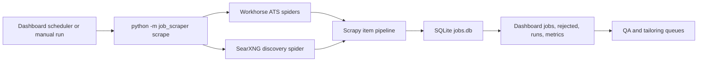

# Job Gathering Process

This document is the canonical high-level map of how TexTailor gathers job
postings, rejects bad matches, stores outcomes, and exposes scrape state in the
dashboard.

## System Boundaries

The job gathering path spans four local pieces:

- **SearXNG** on `localhost:8888` provides broad web-search discovery.
- **`job-scraper/`** runs Scrapy spiders and the filtering/storage pipeline.
- **SQLite** at `~/.local/share/job_scraper/jobs.db` stores jobs, rejections,
  dedup history, run metadata, and per-tier counters.
- **Dashboard** on `localhost:8899` starts runs, shows run/job state, and feeds
  accepted jobs into QA and tailoring workflows.

The scraper does not POST jobs into the dashboard. The dashboard reads the same
SQLite database that the scraper writes.



## Run Entry Points

### Scheduled Runs

The dashboard backend owns scheduled scraping through
`dashboard/backend/services/scrape_scheduler.py`.

When `TEXTAILOR_SCRAPE_SCHEDULER=1`, the FastAPI app starts an APScheduler job
using `scrape_profile.cadence` from `job_scraper/config.default.yaml`. The
current default cadence is every six hours:

```yaml
scrape_profile:
  cadence: "0 */6 * * *"
  rotation_groups: 4
  seen_ttl_days: 45
  discovery_every_nth_run: 2
```

Each tick:

1. Counts historical rotated runs to compute `run_index`.
2. Computes `rotation_group = run_index % rotation_groups`.
3. Always includes the `workhorse` tier.
4. Includes the `discovery` tier only every `discovery_every_nth_run`.
5. Skips the tick if another scrape is already active.
6. Calls the same dashboard scrape-run handler used by manual runs.

Before the scheduler starts, it verifies that the configured Ollama model for
the LLM gate is available when the gate is enabled.

### Manual Runs

Manual dashboard runs go through `POST /api/scrape/run`, implemented by
`job-scraper/api/scraping_handlers.py` and the shared helper in
`dashboard/backend/app.py`.

The helper launches a subprocess:

```bash
python -m job_scraper scrape -v
```

Optional arguments can scope the run:

```bash
python -m job_scraper scrape -v --spider ashby
python -m job_scraper scrape -v --tiers workhorse,discovery
python -m job_scraper scrape -v --tiers workhorse --rotation-group 2 --run-index 30
```

Manual and scheduled runs both write a log under:

```text
~/.local/share/job_scraper/manual_scrape_YYYYMMDDTHHMMSSZ.log
```

The dashboard exposes live process state through:

- `GET /api/scrape/runner/status`
- `GET /api/runs/active`
- `GET /api/runs/{run_id}/logs` while a run is active

## Source Tiers

The scraper divides sources into tiers in `job_scraper/tiers.py`.

| Tier | Purpose | Current spiders |
|---|---|---|
| `workhorse` | High-signal direct ATS collection from known companies | `ashby`, `greenhouse`, `lever`, `workable` |
| `discovery` | Broad search for unknown or newly surfaced jobs | `searxng`, plus legacy `aggregator` and `generic` |

Tier matters because scheduling, rotation, LLM gating, and metrics all branch on
it.

## Workhorse Collection

Workhorse spiders read configured boards from `job_scraper/config.default.yaml`.
They prefer structured ATS APIs instead of scraping rendered pages:

- **Ashby**: `https://api.ashbyhq.com/posting-api/job-board/{org}?includeCompensation=true`
- **Greenhouse**: `https://boards-api.greenhouse.io/v1/boards/{org}/jobs?content=true`
- **Lever**: `https://api.lever.co/v0/postings/{slug}?mode=json`
- **Workable**: configured Workable boards

Each workhorse spider:

1. Loads enabled boards for its ATS.
2. Applies the current `rotation_group`.
3. Chooses a diversified per-run subset so a single run stays bounded.
4. Emits `JobItem` records with normalized fields such as URL, title, company,
   board, location, salary, HTML/text, source, and timestamp.

Rotation uses a stable SHA-256 hash, so a board consistently belongs to the same
group across runs. A `None` rotation group means "run all groups", which is used
for ad hoc/manual runs when no group is supplied.

## Discovery Collection

The `searxng` spider is the broad discovery path. It reads configured query
templates from `config.default.yaml`, then asks local SearXNG for JSON results.

For each selected query, it builds a search string from:

- optional `site:{board_site}`
- quoted `title_phrase`
- optional suffix such as `remote` or `remote USA`

The spider samples a diversified subset of queries each run, currently up to 20
query templates, and asks two pages per query. Time ranges rotate between
`day`, `week`, and `month` based on the run seed.

Discovery performs an early quality pass before emitting items:

- Drops empty URLs.
- Drops `usajobs.gov`.
- Drops configured blocked domains.
- Drops known low-signal hosts such as broad job aggregators.
- If a query has `board_site`, requires the result URL to match that site.
- Keeps only trusted job-board patterns such as Ashby, Greenhouse, Lever,
  LinkedIn, Workday, BambooHR, iCIMS, SmartRecruiters, Workable, and Jobvite.
- Normalizes away query strings/fragments to reduce duplicate URLs.

Discovery items are intentionally thinner than ATS API items. Often the initial
JD text is only the search result snippet, so later filters and the LLM gate do
more work.

During fingerprint generation, the scraper also scans fetched HTML, snippets,
and extracted JD text for high-confidence original ATS links from Ashby,
Greenhouse, Lever, and Workable. When an aggregator or generic page exposes one
of those apply URLs, the fingerprint layer prefers the ATS canonical URL and ATS
job ID for deduplication.

## Scrapy Pipeline

Pipeline order is configured in `config.default.yaml` and loaded by
`job_scraper/settings.py`.

Current order:

```text
text_extraction -> dedup -> hard_filter -> llm_relevance -> storage
```

### 1. Text Extraction

`TextExtractionPipeline` keeps existing `jd_text` if present. Otherwise it uses
Trafilatura to extract text from `jd_html`, then falls back to the snippet.
Items with no usable JD text are dropped before storage.

### 2. Deduplication

`DeduplicationPipeline` checks the `seen_urls` table before doing expensive
filtering.

- New URLs are marked seen immediately.
- URLs seen inside `scrape_profile.seen_ttl_days` are dropped.
- Permanently rejected URLs are always treated as seen.
- The fingerprint layer checks canonical URL, ATS provider/job ID,
  normalized company/title/location/salary, content hash, and conservative
  title similarity.
- Raw hits, dedup drops, and duplicate classes are counted in `run_tier_stats`.

The current default TTL is 45 days, which intentionally exceeds multiple
rotation cycles.

### 3. Hard Filters

`HardFilterPipeline` applies deterministic policy gates. Failed gates do not
drop the item; they mark it as `status='rejected'` with `rejection_stage`,
`rejection_reason`, and JSON `filter_verdicts`, then allow storage.

Major hard-filter categories:

- blocked domains and aggregator tokens in ATS paths
- bad/unknown company values
- title blocklist
- non-US location signals in title, location, or JD text
- configured content blocklist such as clearance requirements
- salary floor policy
- remote requirement
- maximum experience-years requirement

This is where obvious misses should be rejected before they can consume LLM
budget.

### 4. LLM Relevance Gate

`LLMRelevancePipeline` runs only for `discovery` tier items. Workhorse sources
skip this stage.

The gate calls the configured OpenAI-compatible Ollama endpoint and asks for a
strict JSON verdict:

```json
{"score": 0, "verdict": "accept|reject|uncertain", "reason": "short", "flags": []}
```

The prompt includes:

- hard requirements: US-based and fully remote
- title/location rejection reminders
- a small candidate persona card from `tailoring/persona/`
- job title, company, board, URL, location, and snippet

Accepted items continue to storage. Rejected or low-scoring uncertain items are
stored as `status='rejected'` with `rejection_stage='llm_relevance'`.

The gate has a per-run call budget (`max_calls_per_run`). If the budget is
exceeded, it switches to rules-only overflow mode and records that in run
metadata. If the LLM endpoint fails and `fail_open=false`, the run fails rather
than silently accepting discovery noise.

### 5. Storage

`SQLitePipeline` writes every surviving pipeline item to `jobs`, including
items already marked `rejected`.

The stored `run_id` ties each job back to its scrape run. Non-rejected stored
items increment `stored_pending` in `run_tier_stats`.

## Database Model

Default database:

```text
~/.local/share/job_scraper/jobs.db
```

Primary tables:

| Table | Purpose |
|---|---|
| `jobs` | Canonical job records, including pending, QA, lead, and rejected statuses |
| `seen_urls` | URL dedup history and permanent rejection markers |
| `job_fingerprints` | Canonical URL, ATS ID, normalized company/title/location/salary fingerprint, content hash, and duplicate classification metadata |
| `runs` | One row per scrape run, including timing, status, counts, rotation, and gate mode |
| `run_tier_stats` | Per-run, per-source counters for raw hits, dedup drops, duplicate classes, filter drops, LLM rejects, and stored records |

Compatibility views:

| View | Purpose |
|---|---|
| `results` | `SELECT *, status AS decision FROM jobs`; used by older dashboard code |
| `rejected` | Rejected-job subset from `jobs`; used by rejected-job screens |

Important `jobs.status` values currently seen in the app include:

- `pending`
- `qa_pending`
- `qa_approved`
- `qa_rejected`
- `lead`
- `rejected`
- `permanently_rejected`

## Run Accounting

At run start, `JobDB.start_run()` inserts a `runs` row with `status='running'`.
`scrape_all()` then seeds zero rows in `run_tier_stats` for every spider that
was scheduled, so a source that produced no items is still visible.

After Scrapy finishes, the run is finalized with:

- `raw_count`: Scrapy scraped plus dropped items
- `dedup_count`: number of `jobs` rows linked to the run
- `filtered_count`: number of rows with `status='rejected'`
- `net_new`: number of rows with `status='pending'` or `status='qa_pending'`
- `error_count`: Scrapy error-log count, raised to at least 1 on LLM gate failure
- `gate_mode`: `normal`, `skipped_by_cadence`, `no_discovery_items`,
  `overflow`, `fail_open`, or `failed`
- `rotation_group` and `rotation_members`
- `status`: `completed` or `failed`

Historical logs are only surfaced live through the dashboard while a run is
active. After completion, inspect the log file directly under
`~/.local/share/job_scraper/`.

## Dashboard Integration

The dashboard backend imports scraping handlers from
`job-scraper/api/scraping_handlers.py` through
`dashboard/backend/services/scraping.py`.

Common scraping endpoints:

- `GET /api/overview`
- `GET /api/jobs`
- `GET /api/rejected`
- `GET /api/runs`
- `GET /api/runs/active`
- `POST /api/scrape/run`
- `GET /api/scrape/runner/status`
- `GET /api/dedup/stats`
- `GET /api/filters/stats`
- `GET /api/scraper/metrics/tier-stats`

The dashboard also exposes runtime controls through `GET/POST /api/runtime-controls`,
but architectural scrape cadence and rotation settings
come from `scrape_profile` in `config.default.yaml` and require a dashboard
restart after editing.

Use the service scripts for production dashboard health:

```bash
./scripts/restart-dashboard.sh
./scripts/doctor-dashboard.sh
```

Do not start ad hoc dashboard processes on port `8899`; that port should be
owned by the `com.jobscraper.dashboard` launchd service.

## QA And Tailoring Handoff

The scraper's job is to populate `jobs`. The downstream workflow begins once a
job is pending, approved, or otherwise selected in the dashboard.

Downstream paths:

- QA screens approve, reject, or LLM-review candidate jobs.
- Mobile/manual ingest can insert jobs directly with `run_id` values such as
  `manual-ingest` or `mobile-ingest`.
- Tailoring queue endpoints enqueue selected jobs for package generation.
- The tailoring engine reads the same DB and writes packages under
  `tailoring/output/`.

## Operational Checks

Quick health pulse:

```bash
curl -fsS http://localhost:8899/api/scrape/runner/status
curl -fsS http://localhost:8899/api/runs/active
curl -fsS http://localhost:8899/api/overview
curl -fsS http://localhost:8899/api/dedup/stats
```

CLI stats:

```bash
cd /Users/conner/Documents/TexTailor
source venv/bin/activate
cd job-scraper
python -m job_scraper stats
python -m job_scraper recent -n 20
python -m job_scraper backfill-fingerprints --dry-run
python -m job_scraper reclassify-fingerprints --dry-run
```

`reclassify-fingerprints` previews by default. Pass `--write` only after the
sample matches look safe; the matcher is intentionally conservative and only
reclassifies existing `new` fingerprints as `similar_posting` when the row
matches an earlier explicit `us-remote` fingerprint.

Recent run accounting:

```bash
sqlite3 -header -csv ~/.local/share/job_scraper/jobs.db \
  "select run_id, started_at, status, raw_count, dedup_count, filtered_count, error_count, gate_mode, rotation_group, net_new from runs order by started_at desc limit 10;"
```

Latest run job-status mix:

```bash
sqlite3 -header -csv ~/.local/share/job_scraper/jobs.db \
  "select status, count(*) from jobs where run_id = (select run_id from runs order by started_at desc limit 1) group by status;"
```

## Common Failure Modes

| Symptom | Likely cause | First check |
|---|---|---|
| Discovery volume collapses | SearXNG engine failures, 429s, disabled engines, narrow query sample | `curl "http://localhost:8888/search?q=security+engineer&format=json"` and SearXNG logs |
| Runs complete but produce only rejections | Hard filters or LLM gate are rejecting most new items | Latest run status mix and rejection-stage counts |
| Many duplicate drops | Seen URL TTL is working, or rotation is revisiting saturated boards | `run_tier_stats.dedup_drops`, `seen_urls` count |
| LLM gate failure | Ollama down, model not pulled, endpoint timeout, invalid JSON | `/api/llm/status`, `ollama list`, scrape log |
| Dashboard says idle but scheduler should be active | Launchd/env mismatch or scheduler disabled | `./scripts/doctor-dashboard.sh` |
| `/api/filters/stats` errors | Dashboard handler/schema mismatch | backend logs and `job-scraper/api/scraping_handlers.py` |

## Tuning Knobs

Primary tuning lives in `job_scraper/config.default.yaml`.

High-impact sections:

- `crawl.targets`: known ATS boards and companies for workhorse spiders
- `queries`: SearXNG discovery templates
- `filter`: title, domain, content, salary, remote, geo, and experience policy
- `pipeline_order`: Scrapy item pipeline sequence
- `scrape_profile`: cadence, rotation, seen TTL, discovery alternation, and LLM gate

When changing source volume, keep these relationships in mind:

- Add known good companies to `crawl.targets` when workhorse volume is low.
- Add or adjust `queries` when discovery breadth is low.
- Tune hard filters before spending more LLM calls.
- Keep `seen_ttl_days` comfortably longer than at least two full rotation cycles.
- Restart the dashboard after changing scheduler/profile settings.

## Code Map

| Concern | Main files |
|---|---|
| CLI/run orchestration | `job_scraper/__main__.py`, `job_scraper/__init__.py` |
| Scheduler | `dashboard/backend/services/scrape_scheduler.py` |
| Dashboard scrape runner | `dashboard/backend/app.py`, `job-scraper/api/scraping_handlers.py` |
| Tier registry and rotation | `job_scraper/tiers.py` |
| Scrapy settings and pipeline order | `job_scraper/settings.py` |
| Config model/defaults | `job_scraper/config.py`, `job_scraper/config.default.yaml`, `job_scraper/scrape_profile.py` |
| Workhorse spiders | `job_scraper/spiders/ashby.py`, `greenhouse.py`, `lever.py`, `workable.py` |
| Discovery spider | `job_scraper/spiders/searxng.py` |
| Pipelines | `job_scraper/pipelines/` |
| SQLite layer | `job_scraper/db.py` |
| Dashboard scraping service shim | `dashboard/backend/services/scraping.py` |
